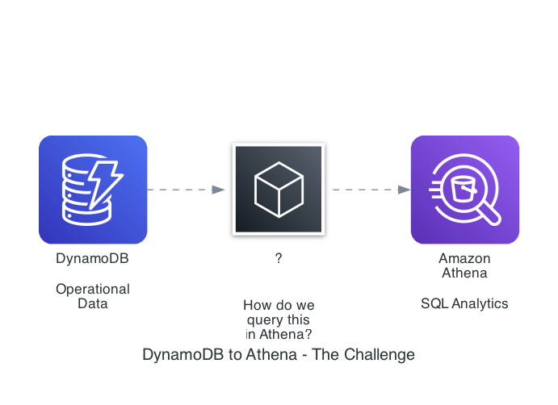

# DynamoDB to Athena Data Pipeline - CDK Example

AWS CDK example demonstrating four different approaches to extract data from DynamoDB
and query it via Athena, highlighting real-world pitfalls and the recommended solution.

## Overview

This project shows the practical challenges of moving DynamoDB data to Athena for analytics:

0. **Approach 1: Glue Crawler on DynamoDB** - The most obvious approach that fundamentally doesn't work
1. **Approach 2: DynamoDB Export (JSON)** - Shows nested type descriptors making queries complex
2. **Approach 3: DynamoDB Export (ION)** - Shows nested type descriptors, simpler than JSON but queries still complex
3. **Approach 4: Glue ETL (Parquet)** - The recommended solution with clean schema

## Architecture

The project is structured into five CDK stacks:

- **DataStack**: Foundation infrastructure (DynamoDB, S3, Glue Database, Athena Workgroup, Lambda seeder)
- **CrawlerDynamoDbStack**: Glue Crawler pointing directly at DynamoDB (demonstrates Athena incompatibility)
- **ExportJsonStack**: DynamoDB Export to JSON with Glue Crawler
- **ExportIonStack**: DynamoDB Export to ION with Glue Crawler
- **EtlParquetStack**: Glue ETL job reading DynamoDB and writing Parquet

### The Challenge



How do we efficiently query DynamoDB data in Athena? Let's explore four different approaches.

## Prerequisites

- AWS CLI configured with appropriate credentials
- Node.js 18+ and npm
- AWS CDK CLI (`npm install -g aws-cdk`)
- Python 3.11+ (for Lambda function)

## Project Structure

```
.
├── bin/
│   └── dynamodb-glueetl-athena-cdk-example.ts  # CDK app entry point
├── lib/
│   └── stacks/
│       ├── data-stack.ts                        # Foundation infrastructure
|       ├── crawler-dynamodb-stack.ts            # Foundation infrastructure
│       ├── export-json-stack.ts                 # JSON export approach
│       ├── export-ion-stack.ts                  # ION export approach
│       └── etl-parquet-stack.ts                 # ETL Parquet approach
├── resources/
│   ├── lambda/
│   │   └── data-seeder/
│   │       └── index.py                         # DynamoDB data seeder
│   └── glue/
│       └── dynamodb-to-parquet-etl/
│           └── job.py                           # Glue ETL job script
└── README.md
```

## Installation

1. Clone the repository:
```bash
git clone <repository-url>
cd dynamodb-glueetl-athena-cdk-example
```

2. Install dependencies:
```bash
npm install
```

3. Bootstrap CDK (if not already done):
```bash
cdk bootstrap
```

## Deployment

### Deploy All Stacks

```bash
cdk deploy --all
```

### Deploy Individual Stacks

```bash
# Deploy foundation first
cdk deploy DataStack

# Then deploy any of the approach stacks
cdk deploy CrawlerDynamoDbStack
cdk deploy ExportJsonStack
cdk deploy ExportIonStack
cdk deploy EtlParquetStack
```

## Comparison Summary

| Approach | Setup Complexity | Data in S3? | Athena Support | Query Simplicity | Performance | Recommended |
|----------|-----------------|-------------|----------------|------------------|-------------|-------------|
| Direct Crawler | Easiest | ❌ No | **No (fundamentally incompatible)** | N/A | N/A | ❌ |
| JSON Export | Easy | ✅ Yes | Yes (but painful) | Complex (type descriptors) | Moderate | ❌ |
| ION Export | Easy | ✅ Yes | Yes (but painful) | Complex (type descriptors) | Moderate | ❌ |
| ETL Parquet | Moderate | ✅ Yes | Yes | Simple (clean schema) | Excellent | ✅ |

## Cost Considerations

- **DynamoDB Export**: Free (doesn't consume RCUs), but requires PITR enabled
- **Glue ETL**: Pay for DPU-hours (2 DPUs × job duration), consumes read capacity from DynamoDB
- **Athena**: Pay per query ($/TB scanned) - Parquet significantly reduces scan costs
- **S3 Storage**: Parquet provides better compression than JSON

For small to medium datasets, the ETL approach is cost-effective. For very large tables (>100GB), consider using the DynamoDB Export connector in Glue.

## Cleanup

To avoid incurring charges, destroy all stacks when done:

```bash
# Delete all stacks
cdk destroy --all

# Or delete individually (reverse order)
cdk destroy EtlParquetStack
cdk destroy ExportIonStack
cdk destroy ExportJsonStack
cdk destroy DataStack
```

Note: S3 bucket and DynamoDB table are configured with auto-delete for demo purposes.
